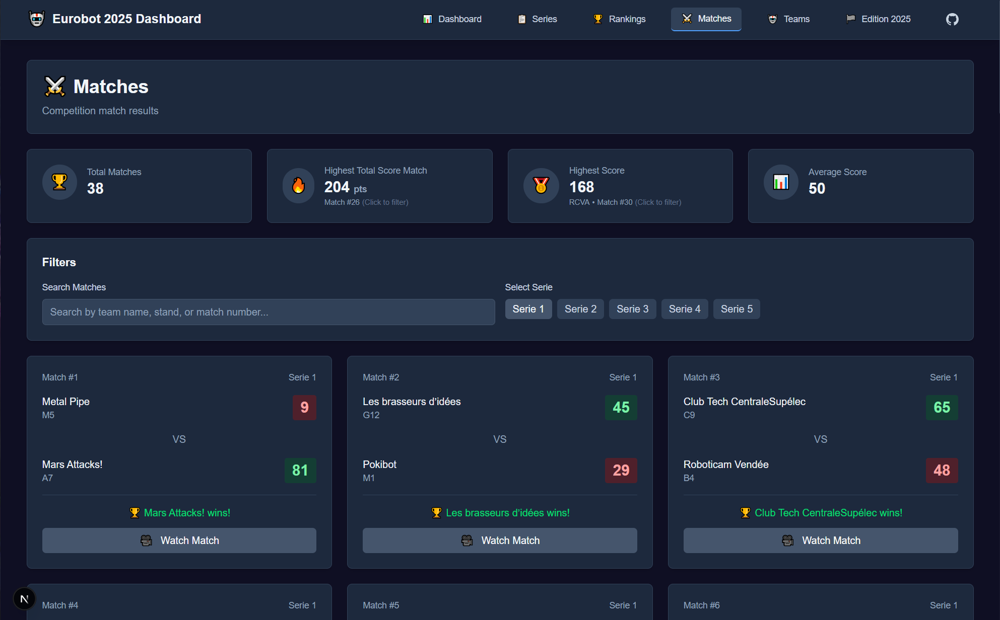

# Eurobot Dashboard

A dashboard for tracking and visualizing Eurobot robotics competition data, including teams, matches, rankings, and series information.



## Features

- 📊 Final Rankings and Statistics
- 🤖 Team profiles and performance tracking
- 🏆 Match results and video
- 📈 Series data visualization

## Tech Stack

- **Frontend**: Next.js, React, TypeScript, TailwindCSS
- **Backend**: Node.js, Express, MongoDB
- **Deployment**: Docker, Docker Compose

## Quick Start

### Prerequisites

- Docker and Docker Compose
- Node.js (for local development)

### Installation

1. Clone the repository:
   ```bash
   git clone https://github.com/yourusername/eurobot_dashboard.git
   cd eurobot_dashboard
   ```

2. Start the application using Docker:

   **Development mode:**
   ```bash
   docker-compose -f docker-compose.dev.yml up
   ```

   **Production mode:**
   ```bash
   docker-compose up
   ```

3. Access the dashboard:
   - Frontend: http://localhost:3000
   - Backend API: http://localhost:5000

## Project Structure

```
eurobot_dashboard/
├── frontend/           # Next.js application
├── backend/            # Node.js API server
├── data/               # Competition data files
├── docker-compose.yml  # Production Docker configuration
└── docker-compose.dev.yml  # Development Docker configuration
```

## Development

To run the frontend and backend separately for development:

**Frontend:**
```bash
cd frontend
npm install
npm run dev
```

**Backend:**
```bash
cd backend
npm install
npm run dev
```

## License

[MIT](LICENSE)
